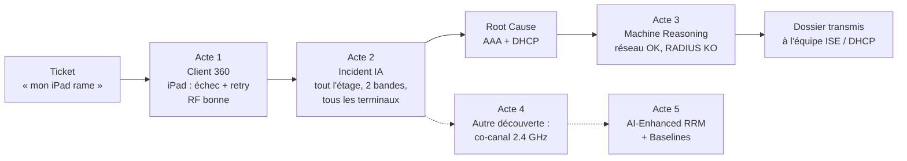
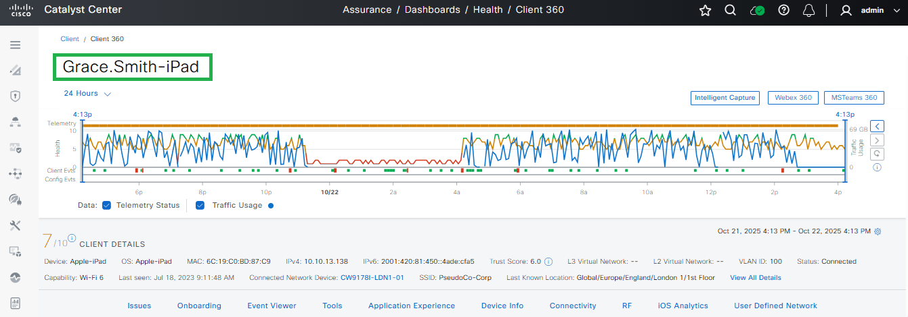
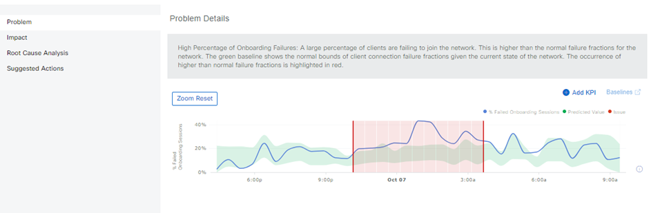
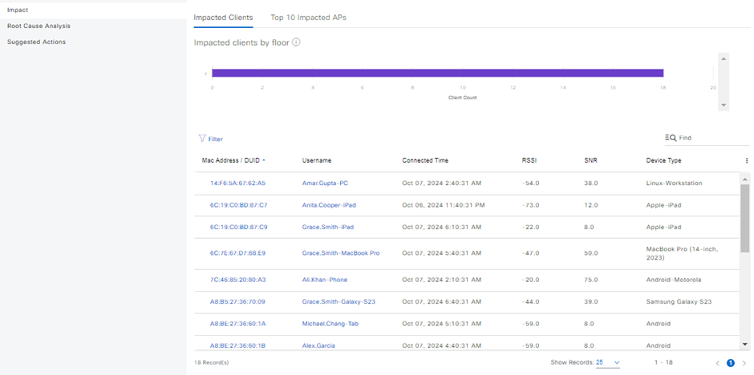
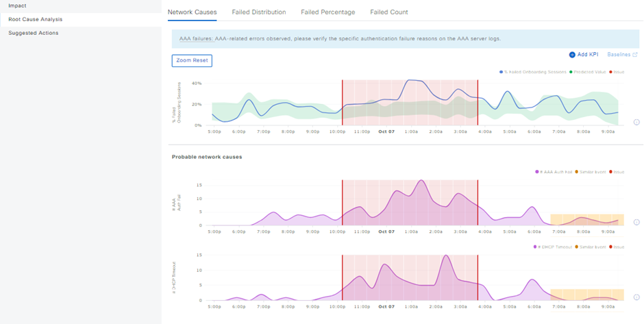
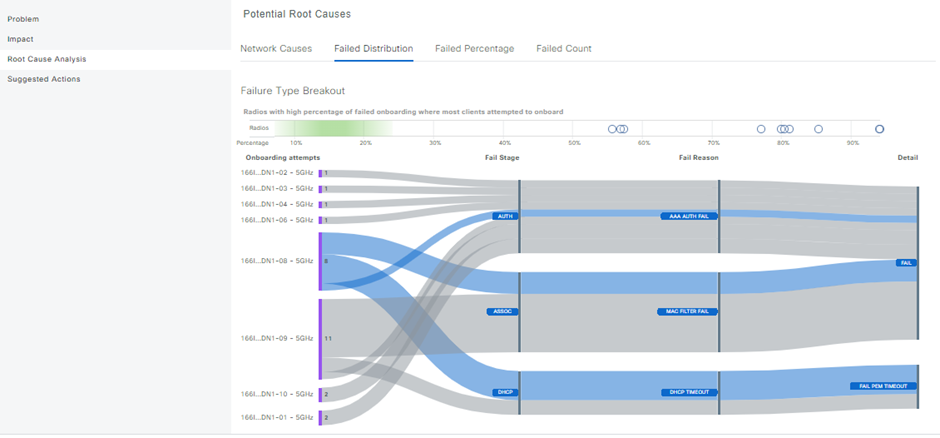
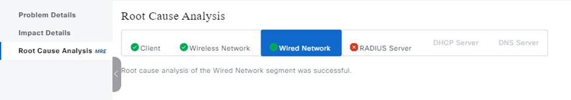
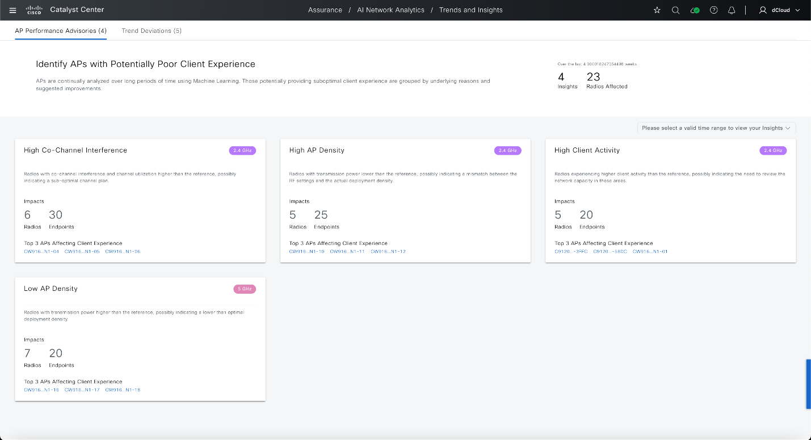
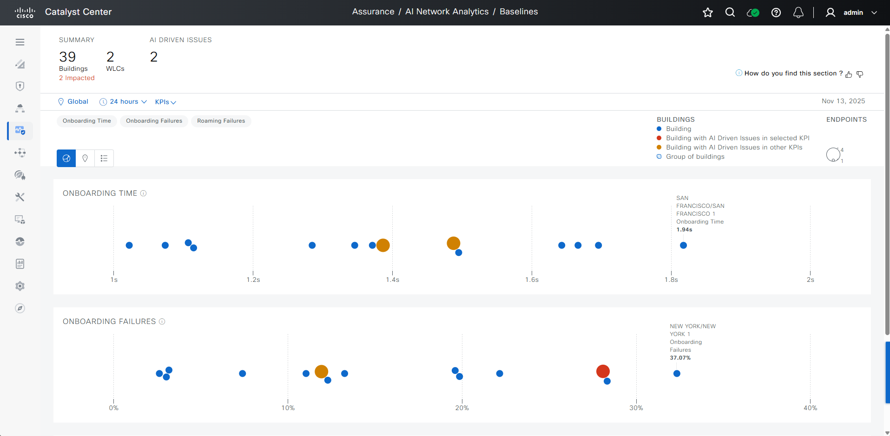
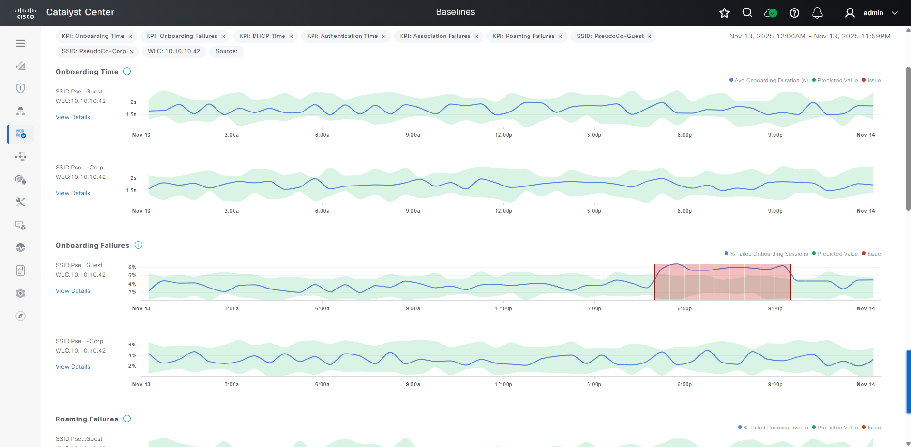

# « Le Wi-Fi rame » : et si on trouvait la cause sans taper une commande ?

Script de démo **Catalyst Center 3.2 Instant Demo (dCloud)** · Troubleshooting wireless · 25 min (version 10 min en fin de document)

**Public :** ingénieurs réseau et wireless (N2-N3), responsables d'exploitation. **Prérequis :** aucun, la démo est simulée et se lance depuis dCloud.

Quand j'échange avec des équipes réseau, le ticket wireless le plus redouté n'est pas la panne franche. C'est le « ça rame » intermittent : signalé après coup, sur un problème qui n'est plus là quand on regarde.

**Comment trouver la cause d'un problème qui n'est pas là au moment où on le regarde ?** C'est le fil rouge de cette démo.

> [!NOTE]
> **Comment lire ce script**
> - **Faire** : les actions dans l'interface, numérotées. Les éléments d'interface sont en **gras**, le texte à taper en `code`.
> - **Message clé** : l'idée à faire passer, lisible d'un coup d'œil pendant le live.
> - **Dire** : le discours complet, en citation, pour la répétition.
> - Chaque acte se termine par un **Plan B** si un écran ne charge pas.
> - Les captures de référence sont repliées sous chaque étape (cliquer pour les ouvrir).

## L'enquête en un coup d'œil

## Sommaire

| Acte | Question | Écrans | Durée | Horloge |
|---|---|---|---|---|
| [Le besoin](#le-besoin) | Le ticket | | 1 min | 0:00 |
| [Acte 1](#acte-1--qui-et-quand-) | Qui et quand ? | AI Assistant, Client 360 | 6 min | 1:00 |
| [Acte 2](#acte-2--grace-ou-tout-létage-) | Grace, ou tout l'étage ? | Issues, AI-Driven Issues | 6 min | 7:00 |
| [Acte 3](#acte-3--prouver-que-ce-nest-pas-le-réseau) | Quelle est la cause ? | Machine Reasoning | 4 min | 13:00 |
| [Acte 4](#acte-4--autre-découverte--la-rf-en-24-ghz) | Autre chose à corriger ? | AP Performance Advisories, Spectrum | 4 min | 17:00 |
| [Acte 5](#acte-5--corriger-et-surveiller) | Ça ne reviendra pas ? | AI-Enhanced RRM, Baselines | 3 min | 21:00 |
| [Conclusion](#conclusion) | | | 1 min | 24:00 |

Annexes : [à vérifier avant la démo](#à-vérifier-avant-la-démo) · [résultats](#les-résultats) · [version courte](#version-courte-10-min) · [ce que la démo prouve](#ce-que-la-démo-prouve-et-ce-quelle-ne-prouve-pas) · [préparation](#préparation) · [pièges](#pièges-en-live) · [questions](#questions-probables)

---

## Le besoin

**Message clé :** un problème intermittent, déjà passé quand on regarde.

**Dire**

> « Lundi matin, chez PseudoCo. Le helpdesk vous transfère un ticket de Grace Smith, site de Londres, 1er étage : *"Mon iPad met des plombes à se connecter au Wi-Fi, ça a commencé cette nuit et ça recommence ce matin."* Deux autres tickets arrivent dans la foulée, d'Anita Cooper et d'Amar Gupta. Même étage.
>
> La méthode classique, vous la connaissez : demander l'adresse MAC, SSH sur le WLC, `show wireless client mac-address … detail`, une radioactive trace… puis attendre que ça se reproduise. Sauf que le problème est intermittent. Quand vous vous connectez, tout a l'air normal. »

Annoncer les quatre questions de l'ingénieur. Chaque acte répond à l'une d'elles.

1. Qui est impacté, et quand ?
2. Un seul client, ou tout l'étage ?
3. Quelle est la cause : la RF, le WLC, l'AAA, le DHCP ?
4. Y a-t-il autre chose à corriger pour que ça ne revienne pas ?

---

## Acte 1 · Qui et quand ?

### 1.1 L'assistant IA… et le piège

**Faire**

1. Ouvrir **AI Assistant**.
2. Catégorie **Troubleshooting** > **Troubleshoot a specific client**.
3. À la question de suivi, taper `grace smith`.

L'assistant répond sur un seul équipement, **Grace.Smith-iPhone** : PseudoCo-Corp en 6 GHz, RSSI -50 dBm, SNR 39 dB, 674 Mbps, 0 % de retry, aucun échec sur 24 h. Verdict : *« No action is required at this time. »*

**Message clé :** l'assistant trouve vite, mais il faut poser la bonne question.

**Dire**

> « Je n'ai qu'un nom dans le ticket. Pas de MAC, pas d'IP. Je demande à l'assistant… et il me dit que tout va bien. C'est exactement la réponse du helpdesk : "j'ai regardé, votre connexion est parfaite". Oui, l'iPhone de Grace va très bien. Mais le ticket parle de l'iPad.
>
> L'assistant a trouvé la personne, le site et le WLC en deux secondes. La bonne question reste : quel équipement, et à quel moment ? »

> [!TIP]
> Ne pas cacher ce moment. Devant une audience sceptique sur l'IA, c'est un point de crédibilité : l'outil aide, l'ingénieur garde la main.

### 1.2 User 360 : une personne, cinq équipements

**Faire**

1. Recherche globale (loupe) : taper `Grace Smith`.
2. Ouvrir le **Client 360** de **Grace.Smith-iPad**.
3. Descendre sur l'onglet **User Defined Network**.

**Message clé :** on raisonne par utilisateur, pas par adresse MAC.

**Dire**

> « Catalyst Center raisonne par utilisateur. Grace Smith a 5 équipements connectés (iPad, MacBook Pro, Galaxy, iPhone, PC). L'iPhone va bien. L'iPad, lui, est en 2.4 GHz. »

### 1.3 La timeline : remonter dans le temps

**Faire**

1. Remonter sur le graphe 24 h en haut de page.
2. Survoler la zone rouge.

**Message clé :** la machine à remonter le temps.

**Dire**

> « Voilà la nuit de l'iPad : pendant plusieurs heures, sa santé s'effondre. Un `show` sur le WLC au moment où je regarde ne m'aurait rien appris. En dessous, sans une commande : score 7/10, Wi-Fi 6, SSID PseudoCo-Corp, VLAN 100, AP CW9178I-LDN1-01. »

Capture de référence : timeline Client 360

### 1.4 L'incident rattaché au client

**Faire**

1. Section **Issues (1)**.
2. Cliquer sur l'incident P1 : *Wireless client took a long time to connect (SSID: PseudoCo-Corp, AP: CW9178I-LDN1-01, Band: 2.4 GHz) · Excessive time due to Association failures*.
3. Lire la **Description**.

**Message clé :** pas une lenteur, un échec suivi d'un retry.

**Dire**

> « 123,4 secondes pour se connecter, au lieu de moins de 10. Pourtant chaque étape est rapide : association 0 s, authentification 1,4 s, adressage IP 1,2 s. La clé est la dernière ligne : 2 tentatives, 120,8 secondes. Ce n'est pas une lenteur, c'est un échec suivi d'un retry. Et la dernière occurrence date de ce matin : c'est bien intermittent. »

### 1.5 Éliminer le suspect n°1 : la couverture

**Faire**

1. **Summary** > **RSSI** > **View Details**.
2. Puis onglet **RF** > **Per Band**.

**Message clé :** ce n'est pas la couverture.

**Dire**

> « Premier réflexe terrain : "il manque une borne". Or le RSSI est bon 100 % du temps (entre -43 et -59 dBm), le SNR autour de 40 dB. On vient d'économiser un site survey. »

### 1.6 Ce que voit l'iPad

**Faire**

1. Onglet **iOS Analytics**.

**Message clé :** la vue côté client, qu'aucun WLC ne donne.

**Dire**

> « L'iPad remonte ce qu'il voit, lui : 5 APs voisines, dont CW9166I-LDN1-05 sur le canal 6 (on va la recroiser), et ses raisons de désassociation. »

> [!TIP]
> **Plan B acte 1.** Si l'assistant ne répond pas, passer directement à la recherche globale. Si le Client 360 ne charge pas, raconter le ticket et aller à l'acte 2 : Grace apparaît dans la liste des clients impactés de l'incident IA.

---

## Acte 2 · Grace, ou tout l'étage ?

### 2.1 Ce que la supervision classique ne voit pas

**Faire**

1. **Assurance** > **Issues and Events** > **Issues**, plage **24 hours**.
2. Cliquer sur le filtre **P1**.

Résultat : 4 incidents P1, tous filaires.

| Priorité | Incident | Rôle |
|---|---|---|
| P1 | Interface Connecting Network Devices is Down | DISTRIBUTION |
| P1 | Layer 2 loop symptoms | DISTRIBUTION |
| P1 | Switch unreachable | BORDER ROUTER |
| P1 | Fabric Devices Connectivity · DHCP Underlay | BORDER ROUTER |

**Message clé :** une dégradation n'est pas une panne.

**Dire**

> « Dans mes P1, le Wi-Fi n'existe pas. Aucun lien down, aucun équipement injoignable. Et pourtant trois personnes n'arrivent pas à se connecter. Il faut une autre façon de détecter ça. »

**Faire**

3. Revenir sur **All**.
4. Activer le toggle **AI-Driven**.

Résultat : 5 incidents P2 marqués **AI** : *Excessive failures to connect*, *Excessive time to connect*, *Excessive time to get an IP Address*, *Drop in radio throughput for Cloud Applications*, *Drop in total radio throughput*.

**Message clé :** pas de seuil fixe, une normale apprise.

**Dire**

> « Ces incidents ne reposent pas sur un seuil fixe. Catalyst Center apprend ce qui est normal pour chaque SSID, chaque bâtiment, chaque heure. Il alerte quand on sort de cette normale. »

### 2.2 La baseline

**Faire**

1. Ouvrir **Excessive failures to connect · High deviation from baseline**.
2. Ouvrir l'instance *At least 11% increase in failures on SSID PseudoCo-Corp in London 1/1st Floor*.

**Message clé :** 40 %, pas 100 % : une dégradation, pas une coupure.

**Dire**

> « La bande verte, c'est le taux d'échec attendu : entre 10 et 25 % selon l'heure. La courbe bleue, c'est la réalité : elle monte à 40 % pendant la nuit. Retenez ce chiffre : 40 %, pas 100 %. Des clients échouent, d'autres passent. »

Capture de référence : baseline de l'incident IA

### 2.3 Impact : qui, et où ?

**Faire**

1. **Impact** > onglet **Impacted Clients**.
2. Pointer la colonne **Username** uniquement (voir l'avertissement ci-dessous).

**Message clé :** tous les terminaux, tous les OS.

**Dire**

> « Et voilà Grace.Smith-iPad dans la liste, avec la même MAC que tout à l'heure. On retrouve aussi Anita.Cooper-iPad et Amar.Gupta-PC : nos deux autres tickets. Et encore le MacBook et le Galaxy de Grace, des PC Linux, des téléphones Android… Ce n'est pas un problème de driver ou de terminal. »

> [!WARNING]
> Dans cette table, la ligne de Grace.Smith-iPad affiche un RSSI de -22 et un **SNR de 8**, ce qui contredit l'acte 1.5. Ne pas s'attarder sur les colonnes RSSI et SNR. Si quelqu'un le relève : « bien vu, sur cette session le SNR était mauvais. Mais regardez le reste : d'autres clients échouent avec un SNR de 38 ou 75, sur d'autres bornes et une autre bande. Le SNR n'explique pas le phénomène d'étage. »

Capture de référence : clients impactés

**Faire**

3. Onglet **Top 10 Impacted APs**.

**Message clé :** plusieurs bornes, deux bandes : le point commun est ailleurs.

**Dire**

> « Côté bornes : CW9166I-LDN1-08 à 94 % d'échecs, -10 à 94 %, -06 à 81 %… Au moins dix APs de l'étage. Et regardez la colonne Band : ces APs sont en 5 GHz, alors que l'iPad de Grace était en 2.4 GHz.
>
> Plusieurs bornes, deux bandes, tous les terminaux : qu'est-ce qu'ils ont en commun ? Pas la RF, pas une borne. Le même SSID, le même WLC… et les mêmes serveurs derrière. »

### 2.4 Root cause : où ça casse

**Faire**

1. **Root Cause Analysis** > onglet **Network Causes**.

**Message clé :** les échecs suivent l'AAA et le DHCP.

**Dire**

> « Les échecs d'onboarding sont corrélés dans le temps avec deux courbes : les échecs d'authentification AAA et les timeouts DHCP. Même fenêtre, même forme. »

Capture de référence : Network Causes

**Faire**

2. Onglet **Failed Distribution**.

**Dire**

> « Chaque tentative ratée, décomposée par étape et par raison : AUTH avec *AAA AUTH FAIL*, ASSOC avec *MAC FILTER FAIL*, DHCP avec *DHCP TIMEOUT*. »

Capture de référence : Failed Distribution

> [!NOTE]
> Le MAC filtering se joue pendant l'association, et il interroge le serveur AAA. C'est pour ça que l'iPad de Grace remontait des « association failures » alors que la radio était bonne. La suggestion n°4 de son incident le disait déjà : vérifier le serveur AAA 192.168.139.168 pendant la MAC Authentication.

**Faire**

3. **Suggested Actions** : vérifier le DHCP, la charge du serveur AAA, le CPU du WLC, la RF.

> [!TIP]
> **Plan B acte 2.** Si l'incident IA ne charge pas, rester sur la P1 de Grace (vue 7 jours) et lire ses 4 actions suggérées, dont la n°4 sur le serveur AAA.

---

## Acte 3 · Prouver que ce n'est pas le réseau

**Faire**

1. **Issues**, plage **7 days**, filtre **P3**.
2. Ouvrir *Wireless clients failed to connect · AAA Server Rejected Clients* (AP CW9166I-LDN1-02).

**Message clé :** prouver que ce n'est pas le réseau.

**Dire**

> « Le métier d'un ingé réseau, c'est souvent de prouver que ce n'est pas le réseau. Ici, un client du même étage (Sargio.Villa, un poste Linux) est rejeté par le RADIUS. »

**Faire**

3. **Root Cause Analysis (MRE)** > **Run Machine Reasoning**.

Résultat attendu :

| Segment | Résultat |
|---|---|
| Client | OK |
| Wireless Network | OK |
| Wired Network | OK |
| RADIUS Server | **En échec** |

Capture de référence : segments du Machine Reasoning

**Message clé :** le Wi-Fi est la victime, pas le coupable.

**Dire**

> « Le Machine Reasoning Engine, c'est l'expertise du TAC Cisco codée en workflows. Il teste chaque segment, un par un, et analyse les syslogs ISE. Client, sans fil, filaire : sains. Le RADIUS : en cause. J'ai l'argument pour l'équipe sécurité, preuves à l'appui.
>
> Alors, quelle est la root cause ? Soyons précis. Un rejet RADIUS, ça veut dire que le serveur répond : il dit non. Ce n'est pas un serveur mort. Ce qu'on a démontré : une dégradation intermittente des services partagés (AAA et DHCP), qui touche tout l'étage, toutes les bornes, tous les terminaux.
>
> Pourquoi l'ISE et le DHCP ont décroché, c'est la prochaine question. Mais je la pose à la bonne équipe, avec un dossier complet, sans avoir attendu que le problème se reproduise. »

> [!TIP]
> Pour une audience avancée : la liste des P1 sur 7 jours contient aussi *Fabric Devices Connectivity · ISE Server*. On peut la citer comme piste à creuser, pas comme une corrélation démontrée par l'outil.

> [!TIP]
> **Plan B acte 3.** Si le Machine Reasoning ne se lance pas, les onglets sont déjà colorés avant l'exécution : Client, Wireless et Wired en vert, RADIUS Server en rouge. Les montrer tels quels.

---

## Acte 4 · Autre découverte : la RF en 2.4 GHz

**Transition**

> « Le ticket est traité : le dossier part chez l'équipe ISE. Mais en creusant, j'ai vu autre chose. Ce n'est pas la cause de l'incident, c'est un chantier à part. »

### 4.1 AP Performance Advisories : 4 semaines d'analyse

**Faire**

1. **Assurance** > **AI Network Analytics** > **Trends and Insights**.

**Message clé :** les incidents, c'est l'aigu. Ici, c'est le chronique.

**Dire**

> « L'IA analyse 4 semaines de données et regroupe les radios qui dégradent l'expérience client, par cause : 4 insights, 23 radios. »

Capture de référence : AP Performance Advisories

**Faire**

2. Cliquer sur la carte **High Co-Channel Interference · 2.4 GHz** (6 radios, 30 endpoints).

**Dire**

> « Dans le top, on retrouve CW9166I-LDN1-05, celle que l'iPad de Grace voyait sur le canal 6. Ces radios subissent beaucoup plus d'interférence co-canal que les radios de référence de votre propre réseau. Remédiation proposée : baisser la puissance (TPC) et désactiver les bas débits. »

**Faire**

3. Cliquer sur la radio **CW9166I-LDN1-05**.
4. Bouton **+** > ajouter le KPI **Speed**.

**Message clé :** un facteur aggravant, pas la cause.

**Dire**

> « La radio tourne plus souvent à bas débit. En 2.4 GHz, c'est du temps d'antenne gaspillé. Un onboarding qui échoue sur un canal saturé, c'est un retry plus long. »

### 4.2 L'AP devient analyseur de spectre (optionnel)

**Faire**

1. **Assurance** > **Health** > onglet **Network**, filtrer sur les APs, ouvrir une AP.
2. **Intelligent Capture** > **Spectrum Analysis** > **Start Spectrum Analysis**.
3. **Next** > **Deploy** > **Submit**.
4. Observer la bande 2.4 GHz, puis basculer en 5 GHz.
5. **Stop Spectrum Analysis** > **Accept**.

**Dire**

> « Pas besoin d'envoyer quelqu'un sur site avec un analyseur. En 2.4 GHz : interférence, duty cycle, FFT temps réel. »

### 4.3 Capture OTA (optionnel)

**Faire**

1. Recherche globale : `CW9166-LDN1-01` > **Device 360**.
2. **Run OTA Capture** > sélectionner 2 APs sur le plan > **Next**.
3. Choisir bande, radio, largeur et canal > **Run** > **Apply**.
4. **Next** > **Deploy** > **Submit**.
5. **Stop** > **Download**.

**Dire**

> « Pour les amateurs de Wireshark : une capture over-the-air pilotée à distance, en PCAP. Pratique pour clore un débat avec un éditeur de terminal. »

> [!TIP]
> **Plan B acte 4.** Si Trends and Insights ne charge pas, résumer oralement (« l'IA a aussi repéré de l'interférence co-canal en 2.4 GHz sur cet étage ») et passer à l'acte 5.

---

## Acte 5 · Corriger et surveiller

### 5.1 AI-Enhanced RRM

**Faire**

1. **Assurance** > **AI Enhanced RRM** > **Launch AI-Enhanced RRM Deployment Workflow**.
2. **Next** > **Enable Without Device Provisioning** > **Next**.
3. Site : `London1` > **Next**.
4. Sélectionner un **AI RF Profile** > **Next** > **Deploy**.

**Message clé :** le plan RF confié à l'IA, sur l'historique.

**Dire**

> « Plutôt que retoucher les canaux AP par AP, je confie le plan RF de London 1 au RRM assisté par l'IA. Il optimise sur l'historique, en 2.4, 5 et 6 GHz. »

### 5.2 Baselines

**Faire**

1. **Assurance** > **AI Network Analytics** > **Baselines**.
2. Rester sur la vue en nuage de points (beeswarm), KPI **Onboarding Time**.
3. Pointer les cercles orange et rouges, puis **SAN FRANCISCO 1**, tout à droite.
4. Ne pas ouvrir LONDON 1 (voir l'avertissement).

**Message clé :** un mauvais chronique ne doit pas devenir invisible.

**Dire**

> « Chaque cercle est un bâtiment. En couleur, ceux qui ont eu des incidents IA. Et regardez SAN FRANCISCO 1 : bleu, donc sans incident, mais tout à droite, avec un temps d'onboarding élevé en permanence. L'IA le considère comme normal, puisque c'est son habitude. C'est pour ça que ce tableau existe. Voilà votre prochain ticket, avant qu'il n'arrive. »

> [!WARNING]
> Dans Baselines, la vue détaillée de LONDON 1 montre une anomalie sur **PseudoCo-Guest** en fin de journée, et un **PseudoCo-Corp normal**. C'est l'inverse de notre histoire : ne pas cliquer sur LONDON 1 ni y ajouter le SSID PseudoCo-Corp.

Captures de référence : beeswarm, et la vue LONDON 1 à éviter

> [!TIP]
> **Plan B acte 5.** Si le workflow RRM ne charge pas, décrire la démarche en une phrase et passer à Baselines. Si Baselines ne charge pas, passer à la conclusion.

---

## Conclusion

**Message clé :** le Wi-Fi va bien, ce sont les services derrière.

**Dire**

> « Le ticket disait "le Wi-Fi rame". La réponse, c'est : le Wi-Fi est la victime. Ce sont l'AAA et le DHCP qui ont décroché, sur tout l'étage. Et on a trouvé en passant un chantier RF en 2.4 GHz. Tout ça sans taper une commande, et sans attendre que le problème revienne.
>
> Et vous, quel est le ticket wireless qui vous a coûté le plus de temps ? »

---

## À vérifier avant la démo

Ces points n'ont pas pu être vérifiés sur une instance live. Les faire une fois, puis adapter le script.

- [ ] **Heure de la timeline.** Dans le Client 360 de Grace.Smith-iPad, noter à quelle heure tombe la zone rouge par rapport à l'heure réelle, pour caler « cette nuit » et « ce matin ».
- [ ] **Conclusion du Machine Reasoning.** Après **Run Machine Reasoning**, noter le texte de conclusion de l'onglet RADIUS Server. S'il cite un motif ISE précis, c'est la phrase à dire en acte 3.
- [ ] **Network Services AAA et DHCP.** **Assurance** > **Health** > **Network Services** > **AAA**, puis **DHCP**. Le guide ne documente que DNS. Si ces écrans sont simulés et montrent le serveur 192.168.139.168 avec des échecs ou de la latence, les ajouter à la fin de l'acte 3 : c'est la vérification côté serveur qui manque à l'histoire.
- [ ] **AI Assistant sur la borne.** Prompt **Troubleshoot a specific access point**, puis `CW9178I-LDN1-01`. Si la réponse est cohérente, l'ajouter à la fin de l'acte 1 (« et la borne de Grace, elle va bien ? »).
- [ ] **AI Assistant, ouverture alternative.** Prompt `Show the list of clients with the worst health scores`. Si Grace.Smith-iPad y figure, c'est une meilleure accroche que le nom seul.
- [ ] **Clients impactés.** Vérifier que Anita.Cooper-iPad et Amar.Gupta-PC figurent bien dans l'onglet Impacted Clients de l'incident IA (ils sont sur la capture du guide).

---

## Les résultats

| Question | Sans Catalyst Center | Avec Catalyst Center |
|---|---|---|
| Qui, quand ? | MAC à demander, `show` sur le WLC, problème déjà passé | Client 360 : la nuit de l'iPad en une recherche |
| Un client ou l'étage ? | Corréler les tickets à la main | Incident IA : tout l'étage, tous les terminaux, comparé à la normale |
| Quelle cause ? | Debugs, radioactive trace, attendre la récidive | Root Cause Analysis et Machine Reasoning : services AAA et DHCP, réseau sain |
| Autre chose à corriger ? | Site survey, analyseur sur place | AP Performance Advisories et spectre, à distance |
| Ça ne reviendra pas ? | Tuning RF manuel | AI-Enhanced RRM et Baselines |

Aucune commande CLI. La cause de l'incident et le chantier de fond identifiés. L'expertise wireless de l'ingénieur sert à décider, plus à collecter.

## Version courte (10 min)

1. Ticket de Grace Smith, et l'assistant qui répond « tout va bien » sur l'iPhone (1 min 30)
2. Client 360 de l'iPad : la timeline, l'incident P1, 2 tentatives en 120,8 s, RSSI bon (3 min)
3. Incident IA : 40 % d'échecs, Grace et les deux autres tickets dans la liste, 5 GHz et 2.4 GHz, AAA et DHCP (3 min)
4. Machine Reasoning : réseau OK, RADIUS en échec (2 min)
5. Teaser AP Performance Advisories : CW9166I-LDN1-05 en co-canal 2.4 GHz (30 s)

## Ce que la démo prouve, et ce qu'elle ne prouve pas

La démo est simulée : chaque écran est un scénario indépendant. L'histoire les relie, mais il faut savoir où s'arrêtent les données.

> [!IMPORTANT]
> **Démontré par les écrans**
> - L'iPad de Grace échoue à l'association puis réessaie (2 tentatives, 120,8 s), avec une bonne RF dans son Client 360.
> - Sur l'étage, le taux d'échec d'onboarding monte à 40 % la nuit, au-dessus de la baseline.
> - Les échecs touchent au moins 10 APs, en 5 GHz et 2.4 GHz, et tous les types de terminaux.
> - Ils sont corrélés avec des échecs AAA et des timeouts DHCP.
> - Pour un client, le Machine Reasoning valide Client, Wireless et Wired, et désigne le RADIUS.

> [!CAUTION]
> **Non démontré, à ne pas affirmer**
> - Pourquoi l'ISE et le DHCP ont décroché (charge, maintenance, lien…).
> - Que le serveur AAA soit tombé : un rejet RADIUS prouve au contraire qu'il répond.
> - Un lien de cause entre la P1 *Fabric Devices Connectivity · ISE Server* et nos échecs.
> - Que l'interférence co-canal 2.4 GHz soit la cause de l'incident : c'est un problème chronique, distinct.
> - Un gain de temps chiffré (« 15 minutes au lieu de deux jours ») : à ne dire que s'il vient de votre propre expérience terrain.

## Préparation

| Point | Détail |
|---|---|
| Navigateur | Google Chrome obligatoire (moteur de simulation) |
| Login | Automatique, sinon `demo` / `demo1234!` |
| Reset | Se déconnecter remet la démo à zéro |
| Onglets à pré-ouvrir | Home, Assurance > Issues and Events, Assurance > AI Network Analytics > Trends and Insights |

> [!WARNING]
> La démo est simulée. Ne cliquer que sur ce parcours, et le répéter une fois avant la séance. L'AI Assistant ne répond qu'aux prompts du script. Les dates varient selon les écrans (2024, 2025, 2026) : dire « cette nuit » et « ce matin », ne pas lire les dates.

## Pièges en live

> [!WARNING]
> - Sur `grace smith`, l'assistant analyse l'iPhone (sain), pas l'iPad. C'est voulu dans le script.
> - Issues sur 24 h : les P1 sont 4 incidents filaires, les incidents wireless IA sont en P2. Sur 7 jours : 9 P1, dont celle de Grace, et l'incident *AAA Server Rejected* (P3) apparaît.
> - La P1 de Grace n'affiche ni client impacté ni Client Count (Site = Global). Le lien avec Grace se fait par son Client 360, ou par l'onglet Impact de l'incident IA.
> - Incident IA, onglet Impacted Clients : l'iPad de Grace y affiche un SNR de 8. Pointer la colonne Username, pas les colonnes RF.
> - Incident IA : le bandeau annonce 8 clients impactés, la table en liste 18. Ne pas citer le chiffre.
> - Top 10 Impacted APs : ce sont des radios 5 GHz. C'est un argument (deux bandes touchées), pas une erreur.
> - Baselines : LONDON 1 montre une anomalie sur PseudoCo-Guest et un PseudoCo-Corp normal. Ne pas l'ouvrir.
> - Le dashlet Summary de User 360 est statique (identique pour tous les clients).
> - Le Client Health dashboard ne filtre que sur Global.
> - Seuls Grace.Smith-iPad et Grace Smith Galaxy-S23 ont des incidents dans Client 360.

## Questions probables

<b>Qu'est-ce qu'il faut pour les incidents IA, AP Performance, Baselines ?</b>

Équipements gérés par Catalyst Center, télémétrie WLC, service cloud Cisco AI Analytics activé. Environ une semaine de données pour les baselines.

<b>Quels WLC ?</b>

La démo tourne sur Catalyst 9800 (`LDN1-C9800-01`). À valider selon la plateforme.

<b>iOS Analytics, pour tous les terminaux ?</b>

Non, Apple uniquement. D'autres constructeurs remontent des infos client (Samsung par exemple), à vérifier selon les versions.

<b>L'IA corrige toute seule ?</b>

Non. Elle détecte, explique, suggère. L'opérateur déclenche et valide.

<b>Mes données partent dans le cloud ?</b>

Seules les fonctions AI Analytics utilisent le cloud (télémétrie). À traiter en rendez-vous dédié.

<b>Licence ?</b>

Assurance avancée et IA relèvent du niveau Advantage. À confirmer avec le partenaire ou l'account manager.

---

Sources : guide public [Catalyst Center 3.2 Instant Demo](https://networkingtoolbox.cisco.com/guides/catalyst-center-instant-demo-3-2/) (captures de `docs/img` extraites de ce guide), et vérifications sur l'instance dCloud (AI Assistant, Issues sur 24 h et 7 jours, P1 CW9178I-LDN1-01).

**Contenu du repo**

- `README.md` : ce script de démo
- `docs/img/` : captures de référence utilisées dans le script
- [`catalyst-center-kb/`](catalyst-center-kb/) : scraper et base de connaissances Markdown du guide (captures complètes non incluses, régénérables avec `scrape.py --images`)
