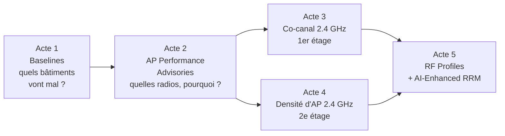
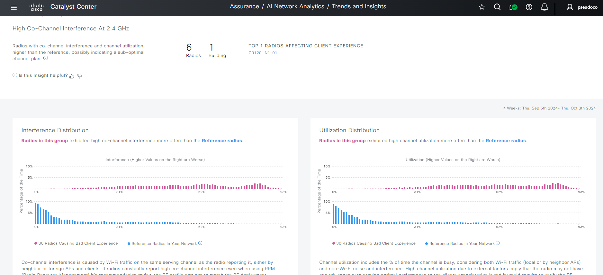
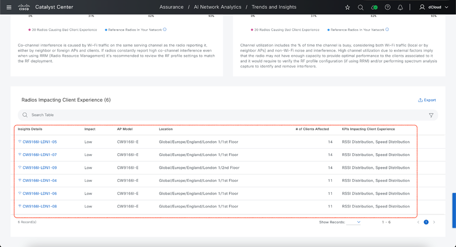
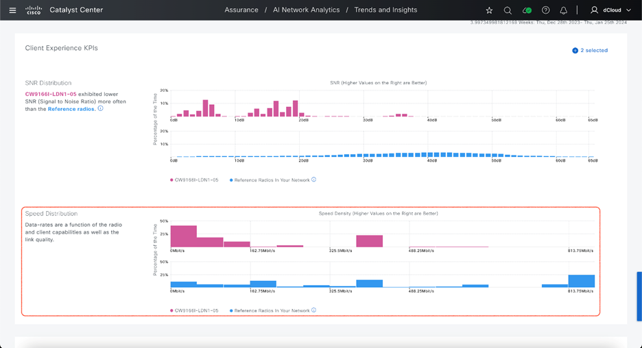
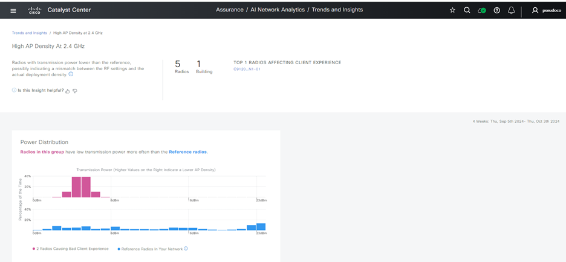
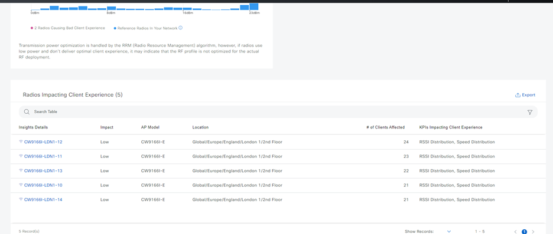
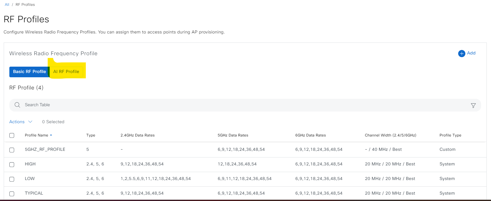
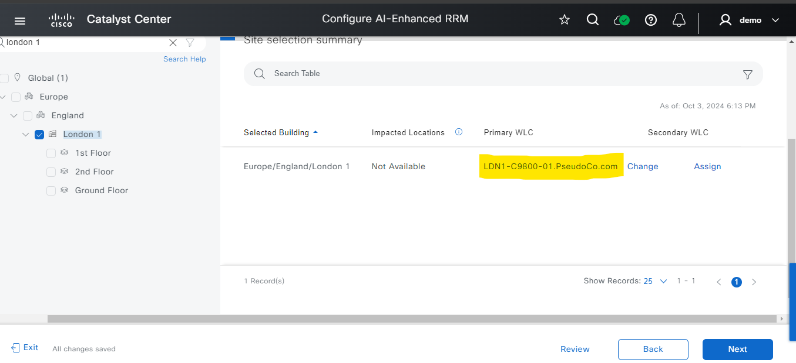
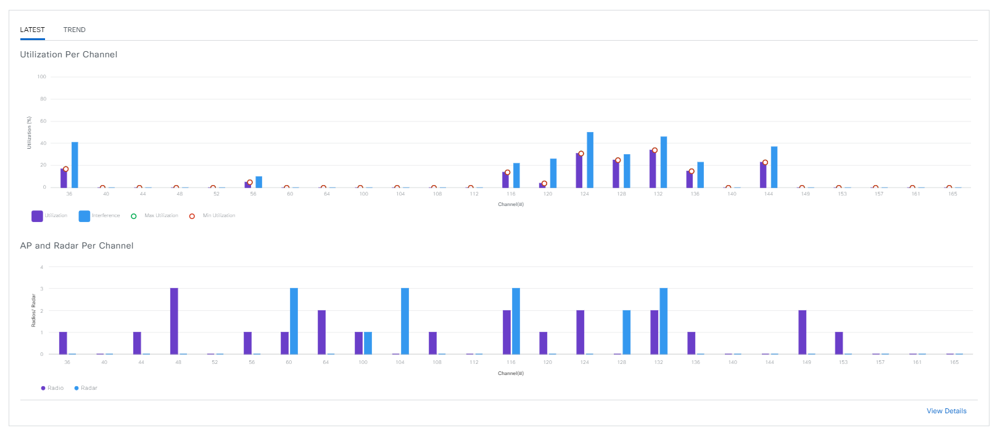

# Pas de ticket, pas de problème ?

Script de démo **Catalyst Center 3.2 Instant Demo (dCloud)** · Wi-Fi proactif · 18 min

**Public :** ingénieurs réseau et wireless, responsables d'exploitation, DSI. **Prérequis :** aucun, la démo est simulée et se lance depuis dCloud.

Quand j'échange avec des équipes réseau, la santé du Wi-Fi se mesure souvent au nombre de tickets. Pas de ticket, pas de problème. Sauf que les utilisateurs ne signalent pas tout : ils s'habituent, ils se reconnectent, ils passent en 4G.

**Et si on trouvait les problèmes Wi-Fi avant que quelqu'un les signale ?** C'est le fil rouge de cette démo : la revue Wi-Fi du lundi matin, en un quart d'heure, sans aucun ticket en entrée.

> [!NOTE]
> **Comment lire ce script**
> - **Faire** : les actions dans l'interface, numérotées. Les éléments d'interface sont en **gras**, le texte à taper en `code`.
> - **Message clé** : l'idée à faire passer, lisible d'un coup d'œil pendant le live.
> - **Dire** : le discours complet, en citation, pour la répétition.
> - Chaque acte se termine par un **Plan B** si un écran ne charge pas.
> - Les captures de référence sont repliées sous chaque étape.

> [!TIP]
> **Pourquoi ce scénario tient debout.** Les écrans de la démo sont des jeux de données indépendants : les relier par des chiffres crée des incohérences. Ici, chaque acte s'appuie sur un seul écran, cohérent avec lui-même. Le lien entre les actes est une démarche (constater, comprendre, corriger), pas une corrélation de données.

## La revue en un coup d'œil

## Sommaire

| Acte | Question | Écrans | Durée | Horloge |
|---|---|---|---|---|
| [Le besoin](#le-besoin) | Pas de ticket, pas de problème ? | | 1 min | 0:00 |
| [Acte 1](#acte-1--quels-bâtiments-vont-mal-) | Quels bâtiments vont mal ? | Baselines | 4 min | 1:00 |
| [Acte 2](#acte-2--quelles-radios-et-pourquoi-) | Quelles radios, et pourquoi ? | AP Performance Advisories | 2 min | 5:00 |
| [Acte 3](#acte-3--le-co-canal-en-24-ghz) | Que se passe-t-il au 1er étage ? | Insight co-canal, détail radio | 5 min | 7:00 |
| [Acte 4](#acte-4--trop-dap-pour-le-24-ghz) | Et au 2e étage ? | Insight densité d'AP | 2 min | 12:00 |
| [Acte 5](#acte-5--corriger) | Comment corriger ? | RF Profiles, AI-Enhanced RRM | 3 min | 14:00 |
| [Conclusion](#conclusion) | | | 1 min | 17:00 |

Annexes : [à vérifier avant la démo](#à-vérifier-avant-la-démo) · [résultats](#les-résultats) · [ce que la démo prouve](#ce-que-la-démo-prouve-et-ce-quelle-ne-prouve-pas) · [préparation](#préparation) · [pièges](#pièges-en-live) · [questions](#questions-probables)

---

## Le besoin

**Message clé :** l'absence de ticket n'est pas une preuve de qualité.

**Dire**

> « Lundi matin, chez PseudoCo. 39 bâtiments, 2 WLC, et aucun ticket Wi-Fi ouvert. Votre DSI vous pose une question simple : "est-ce que notre Wi-Fi est bon ?"
>
> Vous pourriez répondre "pas de ticket, pas de problème". Mais on sait tous que les utilisateurs ne signalent pas tout. Ils se reconnectent, ils passent en 4G, ils s'habituent. Le jour où le ticket arrive, le problème est là depuis des semaines.
>
> Je vous propose la revue que je ferais chaque lundi : un quart d'heure, trois écrans, aucune commande. »

Annoncer les trois temps de la revue :

1. **Constater** : quels bâtiments sortent du lot ?
2. **Comprendre** : quelles radios, et pour quelle cause ?
3. **Corriger** : quelle action, et comment vérifier qu'elle tient ?

---

## Acte 1 · Quels bâtiments vont mal ?

### 1.1 Le parc en un écran

**Faire**

1. **Assurance** > **AI Network Analytics** > **Baselines**.
2. Rester sur la vue en nuage de points (beeswarm), plage **24 hours**.

**Message clé :** tout le parc sur un écran, chaque cercle est un bâtiment.

**Dire**

> « En haut : 39 bâtiments, 2 WLC. En dessous, chaque cercle est un bâtiment. Sa position, c'est la valeur moyenne du KPI. Sa taille, c'est le nombre de clients. Sa couleur dit si l'IA a levé un incident : bleu, rien ; orange ou rouge, un incident. »

Capture de référence : beeswarm Baselines

### 1.2 Le bâtiment que personne ne signale

**Faire**

1. Descendre sur le KPI **Onboarding Failures**.
2. Survoler le cercle bleu le plus à droite : **NEW YORK 1**, environ 37 % d'échecs d'onboarding.

**Message clé :** 37 % d'échecs, et aucune alerte.

**Dire**

> « Regardez ce cercle. New York 1 : plus d'un tiers des connexions Wi-Fi échouent au premier essai. Et il est bleu : aucun incident.
>
> Pourquoi ? Parce que l'IA compare chaque bâtiment à sa propre normale. Et à New York, 37 % d'échecs, c'est la normale depuis longtemps. Une baseline apprend ce qui est habituel, y compris une mauvaise habitude. »

### 1.3 Le même phénomène, sur un autre KPI

**Faire**

1. Remonter sur le KPI **Onboarding Time**.
2. Survoler le cercle le plus à droite : **SAN FRANCISCO 1**, 1,94 s.

**Dire**

> « Même lecture sur le temps de connexion : San Francisco 1 est le plus lent du parc. Rien de dramatique pour un utilisateur, mais c'est structurel, et aucune alerte ne le dira jamais.
>
> C'est tout l'intérêt de ce tableau : les incidents IA détectent ce qui change. Ce tableau montre ce qui ne change pas, et qui devrait. »

> [!NOTE]
> Les incidents IA et les baselines se complètent : les premiers repèrent une rupture par rapport à la normale, les secondes permettent de comparer les normales entre elles.

> [!TIP]
> **Plan B acte 1.** Si le beeswarm ne charge pas, basculer sur la vue liste (icône à droite des onglets de vue) et trier par KPI.

---

## Acte 2 · Quelles radios, et pourquoi ?

**Faire**

1. **Assurance** > **AI Network Analytics** > **Trends and Insights**.
2. Onglet **AP Performance Advisories**.

Résultat : 4 insights, 23 radios concernées, sur les 4 dernières semaines.

| Insight | Bande | Radios | Endpoints |
|---|---|---|---|
| High Co-Channel Interference | 2.4 GHz | 6 | 30 |
| High AP Density | 2.4 GHz | 5 | 25 |
| High Client Activity | 2.4 GHz | 5 | 20 |
| Low AP Density | 5 GHz | 7 | 20 |

**Message clé :** pas des alertes, des diagnostics groupés par cause.

**Dire**

> « Baselines me dit quels bâtiments. Ici, je descends au niveau des radios. L'IA a analysé 4 semaines de données, isolé les radios qui dégradent l'expérience client, et les a regroupées par cause probable. Chaque carte, c'est un diagnostic avec sa remédiation.
>
> Et regardez : trois cartes sur quatre concernent le 2.4 GHz. Ça ne surprendra personne ici. »

Capture de référence : AP Performance Advisories

> [!NOTE]
> Sous le capot : l'algorithme se concentre sur les radios les plus utilisées, compare leurs KPI (RSSI, SNR, retries…) à une référence par bande, regroupe les radios aux comportements proches (apprentissage non supervisé), puis identifie les facteurs explicatifs (interférence, puissance, CPU…) avec des arbres de décision. La remédiation vient de l'expertise Cisco.

> [!TIP]
> **Plan B acte 2.** Si les cartes ne chargent pas, raconter l'algorithme ci-dessus et passer à l'acte 5.

---

## Acte 3 · Le co-canal en 2.4 GHz

### 3.1 Le diagnostic

**Faire**

1. Cliquer sur la carte **High Co-Channel Interference · 2.4 GHz**.

**Message clé :** en rose mes radios à problème, en bleu mes bonnes radios.

**Dire**

> « Deux graphes. À gauche, l'interférence co-canal. À droite, l'utilisation du canal. En rose, les radios du groupe. En bleu, les radios de référence : les autres radios de votre propre réseau, pas une moyenne théorique.
>
> Les bleues sont collées à gauche : peu d'interférence, canal peu occupé. Les roses s'étalent jusqu'à 90 %. Même réseau, même matériel, deux mondes. »

Capture de référence : distributions interférence et utilisation

### 3.2 Les radios concernées

**Faire**

1. Descendre sur le tableau **Radios Impacting Client Experience**.

**Dire**

> « Et voilà les radios : CW9166I-LDN1-05, -07, -04, -06, -08 au 1er étage de Londres, et -09 au 2e. Un étage entier, pas une borne isolée. C'est un problème de plan de fréquences, pas de matériel. »

Capture de référence : radios concernées

### 3.3 Une radio en détail

**Faire**

1. Cliquer sur **CW9166I-LDN1-05**.
2. Lire le bandeau de diagnostic en haut de page.
3. Dans **Client Experience KPIs**, bouton **+** > ajouter **Speed**.

**Message clé :** SNR bas, bas débits : le client paie le co-canal.

**Dire**

> « Le diagnostic est écrit en clair : forte utilisation du canal due à l'interférence co-canal. Il faut revoir le plan de canaux et la répartition de charge, et vérifier les réseaux voisins.
>
> Côté client, le SNR de cette radio tourne entre 0 et 20 dB, là où les radios de référence sont entre 30 et 45. J'ajoute le débit : la radio passe l'essentiel de son temps sur les débits les plus bas. En 2.4 GHz, un client lent, c'est du temps d'antenne pris à tous les autres. »

Capture de référence : SNR et débits de la radio

> [!TIP]
> **Plan B acte 3.** Si la page de détail ne charge pas, rester sur le tableau des radios et lire le texte de remédiation sous les graphes.

---

## Acte 4 · Trop d'AP pour le 2.4 GHz

**Faire**

1. Revenir sur **Trends and Insights**.
2. Cliquer sur la carte **High AP Density · 2.4 GHz**.
3. Descendre sur le tableau des radios.

**Message clé :** la cause racine du co-canal, c'est la densité.

**Dire**

> « Deuxième carte, même bâtiment. Ces radios émettent à très faible puissance, entre 2 et 5 dBm, alors que les radios de référence utilisent toute la plage. Traduction : le RRM baisse la puissance parce qu'il y a trop d'AP pour la surface.
>
> Et on retrouve la physique du 2.4 GHz : trois canaux sans recouvrement. Trop d'AP en 2.4 GHz, c'est du co-canal garanti. Les deux cartes racontent la même histoire. Mon hypothèse, classique sur le terrain : un déploiement dimensionné pour le 5 GHz, avec le 2.4 GHz resté allumé sur toutes les bornes. »

Captures de référence : distribution de puissance et radios

> [!NOTE]
> Les leviers classiques (recommandation terrain, pas un texte de l'outil) : désactiver une partie des radios 2.4 GHz, ou basculer des radios en 5/6 GHz avec la Flexible Radio Architecture (FRA) sur les modèles qui la supportent, et désactiver les bas débits.

---

## Acte 5 · Corriger

### 5.1 Les bas débits, dans les RF Profiles

**Faire**

1. **Design** > **Network Settings** > **Wireless** > **RF Profiles**.
2. Montrer la colonne **2.4GHz Data Rates** des profils système.

**Message clé :** les bas débits, c'est un réglage.

**Dire**

> « L'insight recommandait de désactiver les bas débits. Regardez les profils : le profil LOW autorise 1, 2 et 5,5 Mbps en 2.4 GHz. TYPICAL et HIGH commencent à 9 Mbps. Supprimer les bas débits, c'est souvent le gain le plus rapide en 2.4 GHz : les vieux clients lents ne monopolisent plus le canal. »

Capture de référence : RF Profiles

### 5.2 AI-Enhanced RRM

**Faire**

1. **Assurance** > **AI Network Analytics** > **AI-Enhanced RRM**.
2. **Launch AI-Enhanced RRM Deployment Workflow** > **Next**.
3. **Enable Without Device Provisioning** > **Next**.
4. Rechercher `London 1`, cocher le bâtiment (WLC principal : LDN1-C9800-01) > **Next**.
5. Sélectionner un **AI RF Profile** > **Next** > **Deploy**.
6. Ouvrir le tableau de bord du site : **Utilization Per Channel**, **AP and Radar Per Channel**.

**Message clé :** le plan de fréquences, recalculé par l'IA sur l'historique.

**Dire**

> « Plutôt que refaire le plan de canaux AP par AP, je passe London 1 en RRM assisté par l'IA. Le RRM classique décide sur l'instant, à partir de ce que le WLC voit. Ici, l'algorithme s'appuie sur l'historique du site, dans le cloud, pour 2.4, 5 et 6 GHz.
>
> Et le tableau de bord devient mon outil de suivi : utilisation par canal, interférence, radar. Lundi prochain, je reviens sur Trends and Insights et je vérifie que les cartes 2.4 GHz ont maigri. »

Captures de référence : sélection du site et tableau de bord RRM

> [!TIP]
> **Plan B acte 5.** Si le workflow RRM ne charge pas, rester sur les RF Profiles et conclure : le réglage des bas débits se fait ici, puis se pousse sur les WLC.

---

## Conclusion

**Message clé :** trouver le problème avant le ticket.

**Dire**

> « Récapitulons. Aucun ticket en entrée. En un quart d'heure : un bâtiment à 37 % d'échecs que personne ne signalait, un étage en co-canal, une densité d'AP inadaptée au 2.4 GHz, et deux actions concrètes (supprimer les bas débits, passer le site en RRM assisté par l'IA).
>
> La vraie question n'est plus "combien de tickets Wi-Fi cette semaine ?". C'est "combien de problèmes ai-je réglés avant qu'ils deviennent des tickets ?".
>
> Et vous, comment mesurez-vous aujourd'hui la qualité de votre Wi-Fi ? »

---

## À vérifier avant la démo

- [ ] **NEW YORK 1 dans Baselines.** Vérifier sur l'instance que le cercle bleu à environ 37 % d'échecs d'onboarding est bien présent et nommé NEW YORK 1.
- [ ] **Cartes AP Performance Advisories.** Vérifier les 4 cartes et leurs chiffres (radios, endpoints) sur l'instance.
- [ ] **Tableau des radios co-canal.** Vérifier la liste CW9166I-LDN1-04 à -09.
- [ ] **Carte High AP Density.** Vérifier qu'elle ouvre bien un tableau de radios, et à quel étage.
- [ ] **RF Profiles.** Vérifier le chemin d'accès (**Design** > **Network Settings** > **Wireless**, ou le lien *See all RF Profile List* en fin de workflow RRM) et les débits du profil LOW.

## Les résultats

| Question | Sans Catalyst Center | Avec Catalyst Center |
|---|---|---|
| Quels bâtiments vont mal ? | On attend les tickets | Baselines : tout le parc sur un écran, y compris les mauvaises normales |
| Quelles radios, pourquoi ? | Site survey, analyse manuelle | AP Performance Advisories : radios regroupées par cause, sur 4 semaines |
| Quelle correction ? | Expertise et tâtonnements | Remédiation proposée, RF Profiles, AI-Enhanced RRM |
| Ça a marché ? | On attend que les tickets baissent | Revue hebdo : les cartes maigrissent, ou pas |

## Ce que la démo prouve, et ce qu'elle ne prouve pas

> [!IMPORTANT]
> **Démontré par les écrans**
> - Baselines montre des bâtiments avec de mauvais KPI sans incident IA (NEW YORK 1, SAN FRANCISCO 1).
> - AP Performance Advisories regroupe les radios par cause et les compare aux radios de référence du réseau.
> - Au 1er étage de London 1, un groupe de radios 2.4 GHz présente plus d'interférence co-canal et d'utilisation que la référence.
> - La radio CW9166I-LDN1-05 a un SNR plus bas et des débits plus faibles que la référence.
> - Des radios 2.4 GHz de London 1 émettent à faible puissance, signe d'une forte densité d'AP.

> [!CAUTION]
> **Non démontré, à ne pas affirmer**
> - La cause des 37 % d'échecs à New York 1 : l'écran ne la donne pas.
> - Que les APs de London 1 utilisent le profil LOW : l'écran RF Profiles montre les profils, pas leur affectation.
> - Un gain chiffré après l'activation de l'AI-Enhanced RRM : la démo ne montre pas d'avant/après.
> - Des nombres de clients impactés : ils varient selon les écrans (voir les pièges).

## Préparation

| Point | Détail |
|---|---|
| Navigateur | Google Chrome obligatoire (moteur de simulation) |
| Login | Automatique, sinon `demo` / `demo1234!` |
| Reset | Se déconnecter remet la démo à zéro |
| Onglets à pré-ouvrir | Baselines, Trends and Insights, AI-Enhanced RRM |

> [!WARNING]
> La démo est simulée. Ne cliquer que sur ce parcours, et le répéter une fois avant la séance. Les dates et les fenêtres d'analyse varient selon les écrans (« 3.9973 weeks », 2023, 2024, 2025) : dire « les 4 dernières semaines », ne pas lire les dates.

## Pièges en live

> [!WARNING]
> - **Nombre de clients impactés.** Il varie selon les écrans d'un même insight (par exemple 14 dans le tableau, 2 sur la page de détail de CW9166I-LDN1-05). Ne citer que les chiffres des cartes de la page d'accueil.
> - **« Top 1 radio ».** Le bandeau de résumé de l'insight co-canal cite une radio *C9120…N1-01* qui n'est pas dans le tableau. Ne pas la lire.
> - **Bande de la carte High AP Density.** Certaines pages de détail affichent « High AP Density At 5 GHz » alors que la carte dit 2.4 GHz. Rester sur le graphe de puissance et le tableau.
> - **Baselines, View Details.** La vue détaillée de SAN FRANCISCO 1 affiche « APs (0) ». Ne pas ouvrir View Details.
> - **Baselines, LONDON 1.** La vue LONDON 1 montre une anomalie sur PseudoCo-Guest. Cohérent en soi, mais hors sujet ici : ne pas l'ouvrir.

## Questions probables

<b>Qu'est-ce qu'il faut pour AP Performance Advisories et Baselines ?</b>

Équipements gérés par Catalyst Center, télémétrie WLC activée, service cloud Cisco AI Analytics activé. Les insights s'appuient sur 4 semaines de données, les baselines sur environ une semaine.

<b>Les insights sont mis à jour à quelle fréquence ?</b>

Chaque semaine, sur une fenêtre glissante de 4 semaines. C'est pour ça que le format « revue du lundi » s'y prête bien.

<b>L'AI-Enhanced RRM remplace le RRM du WLC ?</b>

Il s'appuie sur le RRM du Catalyst 9800 et l'enrichit avec l'analyse cloud de l'historique du site. La démo montre l'activation « sans provisioning » ; en production, valider le mode de déploiement et le profil RF avec l'équipe wireless.

<b>Pourquoi ne pas simplement éteindre le 2.4 GHz ?</b>

Parce que des terminaux (IoT, scanners, vieux équipements) n'ont que du 2.4 GHz. On réduit le nombre de radios 2.4 GHz actives et on supprime les bas débits, plutôt que de couper la bande.

<b>Mes données partent dans le cloud ?</b>

Les fonctions AI Analytics utilisent le cloud (télémétrie). À traiter en rendez-vous dédié avec la fiche de confidentialité Cisco.

---

Sources : guide public [Catalyst Center 3.2 Instant Demo](https://networkingtoolbox.cisco.com/guides/catalyst-center-instant-demo-3-2/), pages AP Performance Advisories, AI-Driven Baseline Dashboard et AI Enhanced RRM (captures de `docs/img` extraites de ce guide).

Voir aussi le [scénario A : troubleshooting d'un ticket wireless](../README.md).
